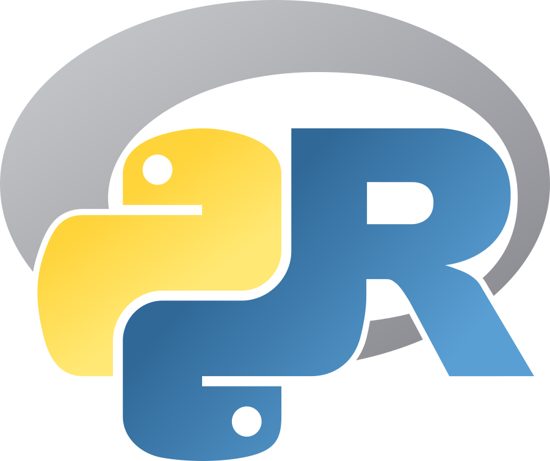

# A Python-R Dictionary for Data Science 

This is a *work-in-progress* dictionary aimed at helping to translate from **Python** to **R** (and viceversa) the most common and basic tasks one could face in the world of data science.

For now, the book is comprised of four macro sections:

- data collection
- data manipulation
- data visualization
- machine learning

